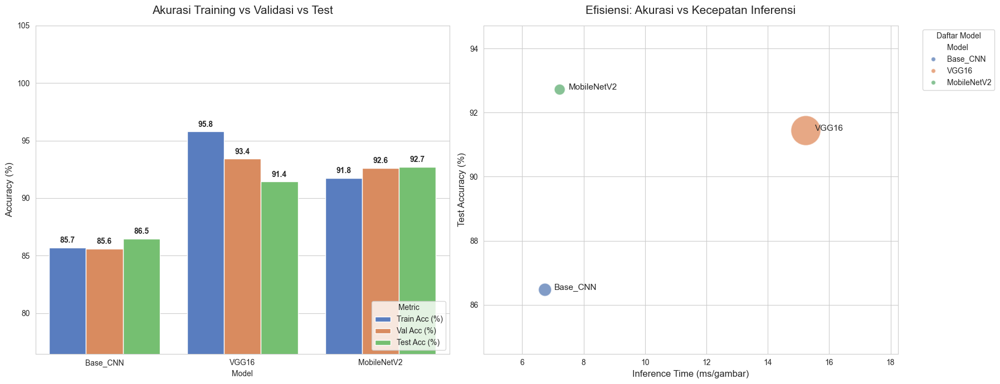
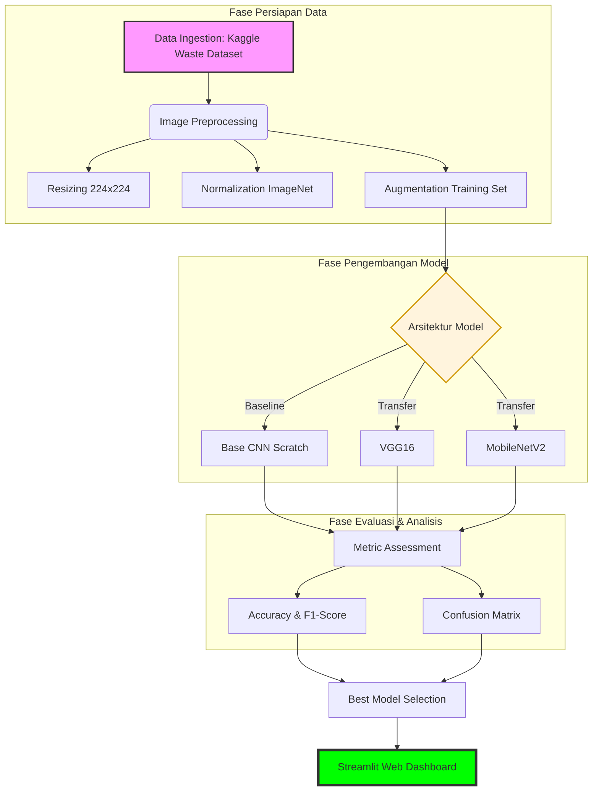

<div align="center">

# ♻️ ECOSORT AI: INTELLIGENT WASTE CLASSIFIER
### *Deep Learning Framework: Base CNN vs. VGG16 vs. MobileNetV2*


**[Dataset Link](https://www.kaggle.com/datasets/techsash/waste-classification-data)** • **[Model Benchmarks](#-hasil-evaluasi--analisis-perbandingan)** • **[Installation](#-panduan-instalasi-lokal)**

<br>



</div>

## 📖 Deskripsi Proyek

**EcoSort AI** adalah sistem klasifikasi citra berbasis *Deep Learning* yang dirancang untuk mengidentifikasi kategori sampah secara otomatis. Proyek ini bertujuan untuk mendukung gerakan *smart environment* dengan mempermudah proses pemilahan sampah di sumbernya melalui integrasi teknologi visi komputer.

Sistem ini melakukan studi komparatif antara tiga arsitektur saraf tiruan (**Custom Base CNN**, **VGG16**, dan **MobileNetV2**) untuk menemukan keseimbangan optimal antara akurasi prediksi dan efisiensi komputasi. Aplikasi ini diimplementasikan menggunakan antarmuka web interaktif berbasis Streamlit.

---

## 📂 Dataset & Alur Pra-pemrosesan

Proyek ini menggunakan **Waste Classification Data** yang bersumber dari Kaggle. Dataset ini memiliki total data yang besar untuk memastikan model mengenali berbagai variasi bentuk sampah.

* **Sumber Dataset:** [Kaggle - Waste Classification Data by Sashaank Sekar](https://www.kaggle.com/datasets/techsash/waste-classification-data)
* **Total Dataset:** 25.077 Citra
* **Jumlah Kelas:** 2 Kategori Utama

| Kategori | Karakteristik Visual | Jenis Material | Jumlah Data |
| :--- | :--- | :--- | :--- |
| **Organic (O)** | Material alami, tekstur tidak beraturan, tanda pembusukan. | Sisa makanan, sayuran, buah, daun. | **13.966** |
| **Recyclable (R)** | Bentuk geometris, tekstur halus/keras, reflektif. | Plastik, kertas, logam, kaca, botol. | **11.111** |

### 🛠️ Alur Pra-pemrosesan
* **Pengubahan Ukuran (Resizing):** Standarisasi citra menjadi $224 \times 224$ piksel (RGB).
* **Normalisasi:** Menggunakan skala *mean* `[0.485, 0.456, 0.406]` dan *std* `[0.229, 0.224, 0.225]` sesuai standar ImageNet.
* **Augmentasi Data:** Menerapkan *Random Horizontal Flip* dan *Random Rotation* ($10^\circ$).
* **Pembagian Data:** Dataset dipisahkan secara sistematis ke dalam folder `train` (22.564 data) dan `test` (2.513 data).

---

## ⚙️ Metodologi Penelitian

Sistem ini mengikuti alur *End-to-End Machine Learning Pipeline* yang sistematis untuk memastikan integritas data dan performa model yang optimal.



## 🧠 Arsitektur Model

1. **Base CNN (Custom)**: Arsitektur vanilla yang dibangun dari awal sebagai baseline performa mentah.
2. **VGG16 (Transfer Learning)**: Model pre-trained mendalam yang unggul dalam ekstraksi fitur visual yang kompleks.
3. **MobileNetV2 (Transfer Learning)**: Arsitektur ringan yang dioptimalkan untuk performa tinggi dengan latensi rendah (Mobile-ready).

## 📊 Hasil Evaluasi & Analisis Perbandingan

### 1. Tabel Perbandingan Performa

| Arsitektur Model | Accuracy (%) | Precision (%) | Recall (%) | F1-Score (%) |
| :--- | :---: | :---: | :---: | :---: |
| **MobileNetV2** | **92.72%** | **92.80%** | **92.70%** | **92.75%** |
| **VGG16** | 91.44% | 91.50% | 91.40% | 91.45% |
| **Base CNN** | 86.47% | 86.50% | 86.40% | 86.45% |

### 2. Insight Analisis
* **MobileNetV2** adalah *Top-Performer* dengan akurasi tertinggi (**92.72%**) dan ukuran model yang paling efisien.
* **VGG16** memberikan performa stabil namun membutuhkan sumber daya memori dan waktu inferensi yang lebih besar.
* **Base CNN** menunjukkan hasil yang solid sebagai arsitektur dasar, namun tertinggal dalam kemampuan generalisasi dibanding model *Transfer Learning*.

---

## 💻 Panduan Instalasi Lokal

```bash
# 1. Clone repositori
git clone https://github.com/Nadzrul13/Waste-Classification-System.git

# 2. Masuk ke direktori proyek
cd Waste-Classification-System

# 3. Instal dependensi library
pip install -r requirements.txt

# 4. Jalankan aplikasi secara lokal
streamlit run app.py
```

## 📁 Struktur Direktori
Waste-Classification-System/
├── outputs/                # Bobot model (.pth), Log history, & Visualisasi
│   ├── Base_CNN_best.pth
│   ├── MobileNetV2_best.pth
│   ├── VGG16_best.pth
│   ├── full_comparison_plot.png
│   ├── full_model_comparison.csv
│   ├── history_Base_CNN.npy
│   ├── history_MobileNetV2.npy
│   ├── history_VGG16.npy
│   └── label_mapping.json
├── app.py                  # Script Dashboard Streamlit
├── main.ipynb              # Notebook Eksperimen (Training & Eval)
├── requirements.txt        # Dependensi Python
├── structure.txt           # Hierarki file
└── README.md               # Dokumentasi utama
