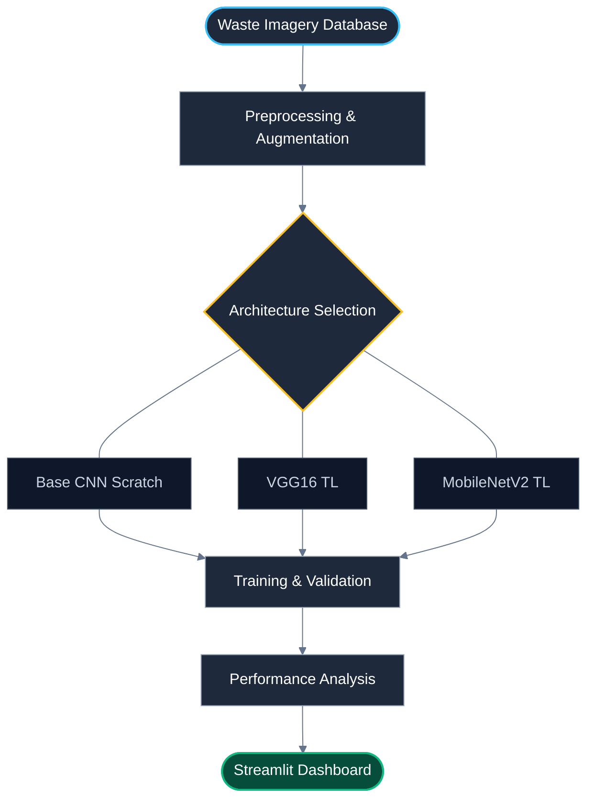

<div align="center">

# ♻️ ECOSORT AI: INTELLIGENT WASTE CLASSIFIER
### *Deep Learning Framework: Base CNN vs. VGG16 vs. MobileNetV2*


**[Dataset Link](https://www.kaggle.com/datasets/techsash/waste-classification-data)** • **[Model Benchmarks](#-hasil-evaluasi--analisis-perbandingan)** • **[Installation](#-panduan-instalasi-lokal)**

<br>

</div>

## 📖 Deskripsi Proyek

**EcoSort AI** adalah sistem klasifikasi citra berbasis *Deep Learning* yang dirancang untuk mengidentifikasi kategori sampah secara otomatis. Proyek ini bertujuan untuk mendukung gerakan *smart environment* dengan mempermudah proses pemilahan sampah di sumbernya melalui integrasi teknologi visi komputer.

Sistem ini melakukan studi komparatif antara tiga arsitektur saraf tiruan (**Custom Base CNN**, **VGG16**, dan **MobileNetV2**) untuk menemukan keseimbangan optimal antara akurasi prediksi dan efisiensi komputasi. Aplikasi ini diimplementasikan menggunakan antarmuka web interaktif berbasis Streamlit.

---

## 📂 Dataset & Alur Pra-pemrosesan

Proyek ini menggunakan **Waste Classification Data** yang bersumber dari Kaggle. Dataset ini memiliki total data yang besar untuk memastikan model mengenali berbagai variasi bentuk sampah.

* **Sumber Dataset:** [Kaggle - Waste Classification Data by Sashaank Sekar](https://www.kaggle.com/datasets/techsash/waste-classification-data)
* **Total Dataset:** 25.077 Citra
* **Jumlah Kelas:** 2 Kategori Utama

| Kategori | Karakteristik Visual | Jenis Material | Jumlah Data |
| :--- | :--- | :--- | :--- |
| **Organic (O)** | Material alami, tekstur tidak beraturan, tanda pembusukan. | Sisa makanan, sayuran, buah, daun. | **13.966** |
| **Recyclable (R)** | Bentuk geometris, tekstur halus/keras, reflektif. | Plastik, kertas, logam, kaca, botol. | **11.111** |

### 🛠️ Alur Pra-pemrosesan
* **Pengubahan Ukuran (Resizing):** Standarisasi citra menjadi $224 \times 224$ piksel (RGB).
* **Normalisasi:** Menggunakan skala *mean* `[0.485, 0.456, 0.406]` dan *std* `[0.229, 0.224, 0.225]` sesuai standar ImageNet.
* **Augmentasi Data:** Menerapkan *Random Horizontal Flip* dan *Random Rotation* ($10^\circ$).
* **Pembagian Data:** Dataset dipisahkan secara sistematis ke dalam folder `train` (22.564 data) dan `test` (2.513 data).

---

## ⚙️ Metodologi Penelitian

Sistem ini mengikuti alur *End-to-End Machine Learning Pipeline* yang sistematis untuk memastikan integritas data dan performa model yang optimal.



## 🧠 Arsitektur Model

1. **Base CNN (Custom)**: Arsitektur vanilla yang dibangun dari awal sebagai baseline performa mentah.
2. **VGG16 (Transfer Learning)**: Model pre-trained mendalam yang unggul dalam ekstraksi fitur visual yang kompleks.
3. **MobileNetV2 (Transfer Learning)**: Arsitektur ringan yang dioptimalkan untuk performa tinggi dengan latensi rendah (Mobile-ready).

## 📊 Hasil Evaluasi & Analisis Perbandingan

Sistem ini diuji menggunakan data independen (*test set*) untuk memastikan objektivitas hasil. Berikut adalah rangkuman performa ketiga model:

### 1. Tabel Perbandingan Performa

| Model | Training Acc | Test Acc | Inf. Time (ms) | Size (MB) | Analysis Comparison |
| :--- | :---: | :---: | :---: | :---: | :--- |
| **MobileNetV2** | **91.8%** | **92.7%** | **7.22 ms** | **8.73 MB** | **Top-Performer.** Efisiensi luar biasa dengan akurasi tertinggi dan ukuran paling ringan. |
| **VGG16** | 95.8% | 91.4% | 15.24 ms | 512.21 MB | **Heavyweight.** Akurasi sangat stabil namun sangat lambat dan memakan banyak ruang penyimpanan. |
| **Base CNN** | 85.7% | 86.5% | 6.74 ms | 42.61 MB | **Fastest Baseline.** Sangat cepat dalam inferensi, namun akurasi masih tertinggal jauh. |

### 2. Insight Analisis Komprehensif
* **Generalisasi**: **MobileNetV2** menunjukkan fenomena menarik di mana akurasi testing sedikit lebih tinggi dari training, menandakan model memiliki kemampuan generalisasi yang sangat kuat terhadap data baru.
* **Efisiensi Ruang**: Terdapat perbedaan drastis pada ukuran file; **MobileNetV2 (8.73 MB)** hampir **60x lipat lebih kecil** dibandingkan **VGG16 (512.21 MB)**, yang membuatnya sangat praktis untuk aplikasi berbasis web.
* **Kecepatan Inferensi**: Meskipun **Base CNN (6.74 ms)** adalah yang tercepat, selisihnya sangat tipis dengan **MobileNetV2 (7.22 ms)**, sehingga MobileNetV2 tetap menjadi pilihan paling rasional karena akurasinya yang jauh lebih unggul.
* **Kesimpulan Akhir**: **MobileNetV2** secara resmi dipilih sebagai mesin utama **EcoSort AI** karena memenangkan hampir seluruh metrik krusial: Akurasi, Ukuran File, dan Efisiensi Generalisasi.
---

## 💻 Panduan Instalasi Lokal

```bash
# 1. Clone repositori
git clone https://github.com/Nadzrul13/Waste-Classification-System.git

# 2. Instal dependensi library
pip install -r requirements.txt

# 3. Jalankan aplikasi secara lokal
streamlit run app.py
```

## 📁 Struktur Direktori
```bash
Waste-Classification-System/
├── outputs/                # Bobot model (.pth), Log history, & Visualisasi
│   ├── Base_CNN_best.pth
│   ├── MobileNetV2_best.pth
│   ├── VGG16_best.pth
│   ├── full_comparison_plot.png
│   ├── full_model_comparison.csv
│   ├── history_Base_CNN.npy
│   ├── history_MobileNetV2.npy
│   ├── history_VGG16.npy
│   └── label_mapping.json
├── app.py                  # Script Dashboard Streamlit
├── main.ipynb              # Notebook Eksperimen (Training & Eval)
├── requirements.txt        # Dependensi Python
├── structure.txt           # Hierarki file
└── README.md               # Dokumentasi utama
```

---

<br />

<div align="center">
  
  
  ### 🏁 EcoSort AI: Final Project
  **Informatics Engineering** **Universitas Muhammadiyah Malang**
  
  ---
  
  *“Technology for a Greener Future”* **Crafted by: [Nadzrul Khair-042](https://github.com/Nadzrul13)**

</div>
